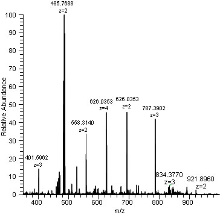

\mainmatter

\pagestyle{fancy}

\renewcommand{\chaptermark}[1]{\markboth{\textsf{Chapter \thechapter.~ Introduction}}{}}
\renewcommand{\sectionmark}[1]{\markright{\textsf{Chapter \thechapter.~ Introduction}}}

## Introduction
*The research presented in this PhD thesis is situated on the verge of computer science and biotechnology.
In order to fully understand and grasp the concepts that are presented throughout this thesis, it is important that I first introduce a set of terms, definitions and techniques that are extensively used throughout this work.*

### Biotechnological concepts

#### The central dogma in biology
Every organism in our universe is made up of cells that contain the instructions that define what the organism is, how it behaves and how new cells should be created.
All cells contains an exact copy of these instructions.
These instructions can be compared with a recipe book that describes and instructs a cook to bake a specific kind of cake.
All recipes are collected in this book, and every cell has an exact copy of this recipe collection.
Whenever a client in the restaurants requests a dish, the request is sent to the kitchen where the cook selects the appropriate recipe from the recipe book and starts making the dish.

This is a simple analogy to explain how DNA and RNA are used in the cells of an organism to create new proteins (\autoref{fig:recipe_book_analogy}).
Our book of recipes stands for the DNA that is present in every cell.
RNA, subsequently, can be regarded as a copy of a single recipe in the book, while the final dish itself corresponds to a single protein.

We can continue to use this analogy to explain how exactly this central dogma of biology takes place in a living organism.
The first step in making a dish is to choose a recipe from the book.
This process is called **transcription**.
In transcription, a section of DNA is copied into an RNA-sequence (more specifically messenger-RNA, or mRNA), which serves as a template for building proteins.

Next, all the necessary ingredients for the dish are gathered.
These can be thought of as the raw materials that are needed to build a protein.
For proteins specifically, these raw materials are amino acids, which are brought to the site of protein synthesis by a molecule called transfer-RNA (or tRNA).

Once all the ingredients have been delivered to the construction site, the cell follows the instructions in the encoded recipe (or thus the instructions encoded by a strand of messenger-RNA, or mRNA).
This process is called **translation**.
In translation, this mRNA template is read by a ribosome, which assembles amino acids in the correct order to form a protein.

The concept explained above, is called the **central dogma of biology**.
It is one of the most fundamental principles of the molecular biology and was depicted by Francis Crick in 1958 and which was reformulated in a manuscript published in Nature in 1970 [@crickCentralDogmaMolecular1970].
The central dogma explains how proteins in organisms are constructed and is very important to grasp in order to understand a lot of the basic principles of biology.

##### DNA
DNA stands for **D**eoxyribo**N**ucleic **A**cid and, as explained above, contains the instructions on how all proteins in an organism can be constructed.
The complete DNA of an organism is present in every cell of this organism and is organised in chemical structures that we call **chromosomes**.
These so-called chromosomes always appear in pairs (humans, for example, have 23 pairs of chromosomes).

A gene is a well-defined piece of the DNA that corresponds to the instructions required to construct one specific protein (and thus corresponds with one recipe of our book of recipes analogy that we used earlier).

The DNA is made up of a sequence of nucleotides (simple molecules that can be chained together) that are represented by the four letters A, C, G and T.

##### RNA
RNA stands for **R**ibo**N**ucleic **A**cid and is chemically very similar to DNA.
Instead of the 4 nucleotides A, C, G and T, RNA is composed of A, C, G and U.
Unlike DNA, the RNA is found in nature as a single strand folded onto itself, rather than a paired double strand.

There exist different types of RNA that are each responsible for an important process in the creation of proteins.
Cellular organisms (such as humans), use messenger RNA (mRNA) to convey genetic information to direct the synthesis of specific proteins.
Secondly, transfer RNA (tRNA) is used for bringing amino acids to the site where protein synthesis takes place.
Lastly, ribosomal RNA (rRNA) chains together amino acids to form finished proteins.

##### Proteins
Proteins are large, complex molecules composed of long chains of amino acids.
Although hundreds of amino acids exist in nature, only 22 of them will appear in proteins.
Every amino acid has its own chemical properties and is generally represented by a single capital letter: **K** stands for lysine, **R** stands for arginine, etc. 
It's the specific ordering of amino acids that defines the function of a protein.

Proteins can have a variety of different functions in an organism.
They can act as enzymes (that help to catalize chemical reactions), to support the immune system, transporters, hormones, signaling molecules, etc.

In short, proteins are a critical component of living organisms and play many important roles in maintaining health and supporting life processes.
A protein will be constructed from an mRNA strand by the **ribosomes**.
These are large molecules that link amino acids together to form proteins in a process called protein synthesis.
See \autoref{fig:dna_transcription_translation} for a schematic overview of the protein synthesis process.

#### (Meta)genome, (meta)transcriptome and (meta)proteome
The **genome** of an organism can be defined as the collection of all genes that are part of the DNA of this organism.
Secondly, the **transcriptome** of an organism is simply the set of all RNA transcripts in an organism.
Lastly, the **proteome** of an organism is the collection of all proteins that can be expressed by an organism.

In this thesis, we mainly discuss the terms **meta**genome, **meta**transcriptome and **meta**proteome.
Instead of respectively refering to the collection of genes, transcripts and proteins that can be expressed by a single organism, the **meta** prefix denotes that we are respectively talking about the set of genes, transcripts or proteins that can be expressed by a collection of different organisms (typically of the same biological environment).
See \autoref{fig:proteome_metaproteome} for a schematic dispaly of the proteome and metaproteome.

Since our DNA provides the instructions for all proteins that can possible by expressed, it provides no suitable information about which proteins are really being expressed at a specific moment in time.
By exploring the genome, it is thus possible to dedice what an organism is capable of doing, but not what it actually *is* doing right now.
Not all pieces of an organism's DNA have a "meaning" or will lead to suitable proteins.
Around 98% of the human genome is non-coding, meaning that these parts of the DNA will never be synthesized to a meaningful protein, but rather to regulatory sequences, non-coding genes or nothing.

Studying the transcriptome of an organism has several advantages over studying the genome.
First of all, it allows researchers to understand dynamic changes that can present themselves during the transcription process in a cell.
The transcriptome reflects the dynamic changes in gene expression that occur in response to environmental cues, developmental stages, and disease conditions.
In contrast, the genome remains mostly static, with relatively stable genetic sequences.
As the transcriptome of an organism captures the expression of genes at a specific time and in a specific context, it provides more information to a researcher and it might help them to understand the underlying mechanisms of diseases, drug responses and other complex biological processes.
Finally, the transcriptome can also be used to study the regulation of gene expression, including alternative splicing, post-transcriptional modifications, and non-coding RNA expression.

The proteome is the most informative and tells researchers which proteins are being synthesized by an organism at a specific point in time.
It allows us to study the functional profile of an organism and goes one step further than a study of the transcriptome.

#### Shotgun metaproteomics (analysing the metaproteome)
In this work, we focus on analysing the metaproteome of an ecosystem.
We will first explain how proteins can be identified from a biological sample by using a very advanced device called a **mass spectrometer**.
Currently, most researchers are using a technique called **shotgun proteomics** when analysing a protein sample and follow a pre-defined set of steps.
Each of the different steps in shotgun proteomics (\autoref{fig:shotgun_metaproteomics}) will be explained in this section.

##### Protein digestion
Since a protein is typically a molecule too big to be analysed by a mass spectrometer, it first needs to be cut into smaller pieces or **peptides**.
The process of cutting a protein into smaller peptides is called **protein digestion** and is performed using a specific enzyme: trypsin.
Other proteases (i.e. enzymes that can be used to digest proteins) exist, but trypsin is by far the most popular one since it digests and *cuts* the protein at a fixed position: everytime the amino acids lysine (K) or arginine (R) are encountered, the protein will be cleaved by trypsin (except when lysine or arginine are directly followed by proline (P)).
See \autoref{fig:trypsin_digestion} for an example of a tryptic digestion of 2 proteins.

##### Mass spectrometry
Before we can start to explain the different steps in shotgun metaproteomics, we need to provide a basic understanding of the mass spectrometer.
A mass spectrometer is a very advanced and expensive device that allows us to measure the "weight" of molecules.
Instead of measuring the force of gravity on an object (which is what a traditional scale does), a mass spectrometer uses magnetic and electric fields to measure the "mass-to-charge" ($m/z$) ratio of the particles in the input sample.

These "mass-to-charges" for each of the particles that were found in the input sample can be visualised as a mass spectrum (see \autoref{fig:mass_spectrum}).
Each peptide that's fed into the mass spectrometer produces a mass spectrum, which is not necessarily unique (i.e. different peptides can produce the same mass spectrum) and the following step in shotgun metaproteomics consists of mapping these mass spectra onto peptide sequences.

##### Matching mass spectra with peptide sequences
Now, in order to map mass spectra back to peptide sequences, researchers use "search engines".
These search engines contain a list of peptides and the corresponding expected mass spectra and try to convert the experimentally obtained spectra with the theoretically modelled mass spectra in the database.

How exactly this is done is out-of-scope for this work, but more information can be found in [@BenchmarkImprovingMethods2022].
The most important thing to realize at this point is that the data that comes out of the mass spectrometer (i.e. the mass spectra) can be converted into the peptide sequences that most probably occur in the input sample.

##### Taxonomic analysis

##### Functional analysis

