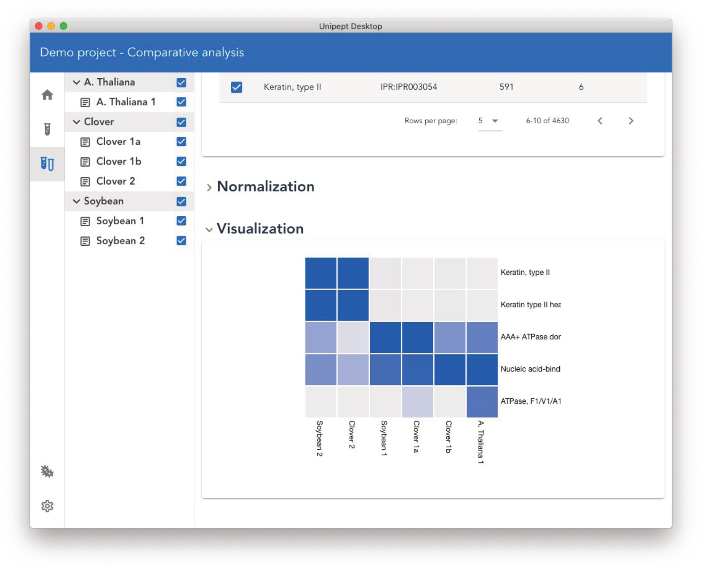

## Unipept Desktop: a faster, more powerful metaproteomics analysis tool
\markright{\textsf{High-throughput metaproteomics analysis}}

**Abstract**
Metaproteomics has become an important research tool to study microbial systems, which has resulted in increased metaproteomics data generation.
However, efficient tools for processing the acquired data have lagged behind.
One widely used tool for metaproteomics data interpretation is Unipept, a web-based tool that provides, amongst others, interactive and insightful visualizations.
Due to its web-based implementation, however, the Unipept web application is limited in the amount of data that can be analyzed.
In this manuscript we therefore present Unipept Desktop, a desktop application version of Unipept that is designed to drastically increase the throughput and capacity of metaproteomics data analysis.
Moreover, it provides a novel comparative analysis pipeline and improves the organization of experimental data into projects, thus addressing the growing need for more performant and versatile analysis tools for metaproteomics data.

### Introduction
Metaproteomics is a relatively young research field that focuses on the study of microbial environments and complex ecosystems, and of the interactions between the organisms involved, through the analysis of the proteins extracted from these environments.
Over the past years, the technology to identify proteins from such complex samples has been greatly improved, allowing metaproteomics to transition from relatively small studies to large scale experiments [@rechenbergerChallengesClinicalMetaproteomics2019; @wilmesDecadeMetaproteomicsWhere2015].
The key enabling technologies for this transition are improved mass spectrometers and more powerful proteomics approaches, which have both come a long way since the introduction of metaproteomics analysis in 2004 [@rodriguez-valeraEnvironmentalGenomicsBig2004; @yatesRecentTechnicalAdvances2019].
To allow efficient processing of the resulting increase of acquired data, various dedicated tools have been made available to support metaproteomics data analysis [@muthMetaProteomeAnalyzerPowerfulOpenSource2015; @vandenbosscheConnectingMetaProteomeAnalyzerPeptideShaker2020], but even with this increased bioinformatics support, many challenges still need to be overcome, especially regarding downstream analysis of the obtained identifications [@schiebenhoeferChallengesPromiseInterface2019].

Unipept is a leading tool for such downstream metaproteomics data analysis [@herbstEnhancingMetaproteomicsValue2016] that currently consists of a web application [@gurdeepsinghUnipeptFunctionalAnalysis2019], a web service, and a command line tool [@verschaffeltUnipeptCLIAdding2020].
The Unipept web application provides users with the ability to analyze a metaproteomics sample and extract taxonomic and functional information from environmental samples derived from a variety of origins, ranging from the human gut to biogas plants.
The Unipept web application provides users with interactive visualizations and allows them to, for example, filter out all functions that are associated with a specific taxon.
Due to its web-based nature, however, the size and number of samples that can be analyzed by Unipept are limited.
And while it is currently possible to analyze larger data sets using the Unipept CLI, this requires more sophisticated bioinformatics skills and does not provide the interactive link between taxa and functional annotations.

Because of the browser limitations, it can already take a substantial amount of time to process relatively small samples (e.g. containing up to a few thousand identified peptides) using Unipept, depending on the specific search configuration used.
These limitations have become an issue, as the advances in metaproteomics have not only increased data set sizes, but have also increased the number of data sets that need to be processed [@zhangPerspectiveGuidelinesMetaproteomics2019].

In order to accommodate this evolution, the throughput of metaproteomics data analyses needs to increase as well, in turn requiring tools that are not constrained in the amount of memory and CPU resources they are allowed to consume.
Moreover, analysis results also need to be retained for future reference, ideally in a project-based approach that can group multiple samples, and the corresponding results should be easily shareable with other researchers.

For specific applications, it is also important that all data is processed offline or on-site rather than being sent over the internet.
For instance, sensitive medical data is often not allowed to be sent to external services for processing, but must be kept in-house to safeguard patient confidentiality and privacy.

All of the above issues need to be resolved in order to support the growing interest in, and reach of, metaproteomics.
We therefore here present the Unipept Desktop Application, a novel cross-platform desktop application designed to specifically overcome these challenges while also retaining the functionality that exists in the current web app.

### Implementation

The Unipept desktop application provides three different types of analyses: *i*) single assay analysis, *ii*) inter-assay comparative analysis, and *iii*) tryptic peptide analysis.
The single assay analysis performs a full taxonomic and functional analysis of a single assay and corresponds to the default “metaproteomics analysis” as presented by the Unipept web application.
The inter-assay comparative analysis on the other hand, provides the ability to explore similarities and differences between multiple assays.
While the comparison of multiple assays was already possible with the Unipept web application, this was only available for a limited number of quite small assays due to strict memory constraints posed by web browsers.
The tryptic peptide analysis, lastly, can be used to look up which proteins, taxa and functions are associated with a given peptide.

Unipept Desktop delivers these core functions through a concise user interface (\autoref{fig:desktop_app_overview_screenshot}) that consists of three main parts: the sidebar, the project explorer, and the content view.
The sidebar on the far left allows the user to navigate between the different analysis pipelines and functions of this application.
Directly to the right of the sidebar is the project explorer that allows the user to switch between assays, and to modify the project.
The project explorer is only shown when performing single assay or comparative analyses.
Assays and studies can be renamed or deleted by right clicking them, after which a context menu opens.
Lastly, the content view takes up most of the application’s visual space and presents either analysis results or the settings page.

The Unipept Desktop Application also allows offline analysis of data through a choice of the API endpoint in the settings menu.
This endpoint, which uses the Unipept API and by default connects to the online Unipept system, can be configured to call any service that supports the Unipept API.
By setting up a local instance of the Unipept backend system, the user can thus ensure that all data remains locally.
Setting up a local Unipept back-end is possible by cloning the open source Unipept repository on GitHub, but requires advanced technical knowledge.
We plan to make the installation process of these custom API endpoints even easier with future releases of Unipept.

Unipept Desktop is powered by the cross-platform Electron framework, which in itself is powered by Chromium browser technology.
This means that the application is developed with web-centric technologies, such as the Vue frontend framework and TypeScript, and hence we were able to reuse large parts of the web app’s codebase.
The choice for the Electron platform was mostly driven by the extensive suite of different functionalities that can be integrated with minimum configuration efforts.
Thanks to the Electron platform we can provide an automatic update mechanism, easily generate installation packages for all major platforms (Windows, macOS and Linux), and include automatic crash reporting, amongst others.
Once installed, the Unipept Desktop application can thus update fully autonomously in the background, ensuring that users always have the latest functionality and bug fixes installed.

#### Project-centric analysis
The Unipept Desktop Application has full access to the local filesystem. Hence, it can store an arbitrary amount of data and does not need to worry about strict size limits;
this in contrast to web applications that are only allowed to store up to a few megabytes using the local storage API.
This allows us to improve upon the organization of data sets by introducing project-based data management capabilities.
In accordance with the terminology introduced by the ISA-tab standard for experimental metadata annotation [@sansoneInteroperableBioscienceData2012], we now refer to a data set derived from a sample as an “assay”, while a study is a grouping of multiple, related assays, and a Unipept project represents a collection of such studies.

On the file system, a project is stored in a single folder that contains an SQLite database file, a subfolder for each study and one text file per assay, located in the subfolder of the corresponding study.
This folder can be modified outside of the application, using the default file explorer application of your operating system, thus providing maximum flexibility.
All changes made to this project folder are automatically detected and imported by the application, granting users the ability to mass import assays and edit project properties with external applications.
The application accepts simple text files with one peptide per line.
In order to quantify peptide occurrence, a peptide can be included more than once in this file and the “filter duplicate peptides” option should be disabled for the analysis.

Because projects are folder-based, they can contain both the raw input data as well as the analysis results for an assay, making it practical for users to share projects with each other, for instance, in the form of compressed project folders.
In addition, previously performed analyses do not need to be recomputed when the application is restarted, as opposed to analyses that were run on the Unipept website, which need to be recomputed every time the website is closed.

#### Comparative analysis

The Unipept Desktop Application provides both intra-assay and inter-assay comparative analyses that are rendered as heatmap visualizations.
The intra-assay comparison can be started from the single assay analysis page by selecting the heatmap tab and provides a wizard to guide users through the set-up process of the comparison (Figure 2).
Users are required to select two types of data sources (one for each axis of the heatmap) and indicate which items should be compared.
Four different data sources are currently supported: NCBI taxa, GO terms [@thegeneontologyconsortiumGeneOntologyResource2019], EC numbers and InterPro entries [@finnInterPro2017Protein2017].

The inter-assay comparative analysis is designed to visualize differences and similarities in functional or taxonomic composition of multiple assays.
Here too, users are presented with a wizard that is similar to the one found in the intra-assay comparison.
For inter-assay comparisons, however, the horizontal axis of the heatmap is reserved for the set of selected assays, and users can therefore only select one collection of items that should be compared between the different assays.

Because the number of peptides can drastically differ between multiple assays, three different normalization techniques are provided to the user.
The default setting normalizes the heatmap globally, i.e. the minimum and maximum values over the complete grid are computed and all grid values are normalized with respect to these values.
The other two normalization techniques also normalize based on minimum and maximum values, but restricted within a row or column, respectively.

It is worth noting that, while the comparative analysis pipeline was originally designed for the Unipept Desktop Application, a slimmed-down version has meanwhile also been integrated into the Unipept web app.

With the advent of the Unipept Desktop Application, users now have a variety of ways in which they can use Unipept.
A comparison between the various functionalities offered by these different services is provided in \autoref{tab:comparison_of_unipept_services}.

\begin{table*}\centering
\ra{1.3}
\begin{tabular}{@{}p{45mm}cccc@{}}\toprule
& desktop app & web app & CLI & API\\ \midrule
visualizations & \Checkmark & \Checkmark & $\sim$ & $\sim$ \\
basic metaproteomics analysis pipeline & \Checkmark & \Checkmark & \XSolidBrush & \XSolidBrush \\
tryptic peptide analysis pipeline & \Checkmark & \Checkmark & \XSolidBrush & \XSolidBrush \\
comparative analysis & \Checkmark & $\sim$ & \XSolidBrush & \XSolidBrush \\
metadata or projects & \Checkmark & \XSolidBrush & \XSolidBrush & \XSolidBrush \\
custom endpoint & \Checkmark & \XSolidBrush & \Checkmark & \XSolidBrush \\
store analysis results & \Checkmark & \XSolidBrush & $\sim$ & \XSolidBrush \\
process large samples & \Checkmark & \XSolidBrush & \Checkmark & \Checkmark \\
no command line knowledge required & \Checkmark & \Checkmark & \XSolidBrush & \XSolidBrush \\
no installation required & \XSolidBrush & \Checkmark & \XSolidBrush & \Checkmark \\
\bottomrule
\end{tabular}
\caption{Comparison of the functionalities provided by the different Unipept services. \label{tab:comparison_of_unipept_services}}
\end{table*}

### Conclusion
Unipept Desktop is a novel desktop application that extends upon the Unipept web application by eradicating the strict limitations posed by the web-based nature of this application to increase metaproteomics data analysis throughput.
Moreover, the Unipept Desktop Application adds new features such as allowing users to structure their data in a hierarchical project-based system, to keep track of their analysis results, and to share or distribute these results very easily.
Whereas the Unipept web application is limited to assays with up to 50 000 peptides, the Unipept Desktop Application supports assays containing one million peptides or more.
For reference, the desktop app can analyze between 250 and 2000 peptides per second (without advanced missed cleavage handling enabled), depending on the type of assay that’s being analyzed.

In a future release of the Unipept Desktop Application, we plan to provide support for the preparation of custom reference databases and further improve support for offline analysis.
This will allow us to gradually evolve to a tool that is not only suitable for metaproteomics data analysis, but also for novel proteogenomics analysis techniques for complex environmental samples.

Our choice for the Electron framework proves to be very valuable as well, as a large portion of Unipept’s codebase can thus be shared between the new desktop application and the existing web application.
This in turn allows us to easily migrate (a slimmed-down version of) specific desktop features to the web app, and vice versa.

### Availability
The source code for Unipept Desktop is open source and provided under the MIT license as a repository on GitHub: [https://github.com/unipept/unipept-desktop](https://github.com/unipept/unipept-desktop).
Pre-generated installers for Windows, macOS and Linux (AppImage format) can be downloaded from the release page of our GitHub repository.
Installation instructions and documentation for the Unipept Desktop Application can be found on our website: [https://unipept.ugent.be/desktop](https://unipept.ugent.be/desktop).

### Acknowledgements
This work was supported by the Research Foundation—Flanders (FWO) \[1164420N to P.V.; 12I5220N to B.M.; 1S90918N to T.V.D.B.; G042518N to L.M.
\].

\newpage

## Support for novel proteogenomics analysis in Unipept
\markright{Support for proteogenomics analyses}

